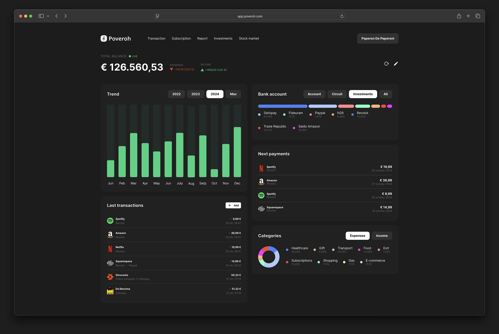

<div align="center">


# Poveroh

#### A unified platform to track your wealth.

<h4>
    <a href="https://github.com/DavideTarditi/poveroh/issues/">Report Bug</a>
  <span> · </span>
    <a href="https://github.com/DavideTarditi/poveroh/issues/">Request Feature</a>
  </h4>

<div>

[](https://opensource.org/licenses/MIT)

</div>

---

> “Money doesn’t buy happiness, but I’d rather cry in a Ferrari.”

</div>

<hr />

<!-- Table of Contents -->

## :notebook_with_decorative_cover: Table of Contents

- [Poveroh](#poveroh) - [A unified platform to track your wealth.](#a-unified-platform-to-track-your-wealth)
    - [:notebook_with_decorative_cover: Table of Contents](#notebook_with_decorative_cover-table-of-contents)
    - [:star2: About the Project](#star2-about-the-project)
        - [Why?](#why)
        - [How it works?](#how-it-works)
        - [:space_invader: Tech Stack](#space_invader-tech-stack)
        - [:art: Color Reference](#art-color-reference)
    - [:toolbox: Getting Started](#toolbox-getting-started)
        - [:bangbang: Prerequisites](#bangbang-prerequisites)
    - [:running: Run Locally](#running-run-locally)
        - [Get start](#get-start)
        - [Backend](#backend)
    - [:compass: Roadmap](#compass-roadmap)
    - [:warning: License](#warning-license)
    - [:link: Useful links](#link-useful-links)

<!-- About the Project -->

## :star2: About the Project

<div align="center"> 
  
</div>

Poveroh is an open-source, web-based platform for tracking personal finances.

### Why?

This platform was born from the desire to track personal finances in a detailed and structured way.

Ok, there are thousands of similar applications out there, but none of them truly fit my needs or convince me entirely. That’s why, driven by the wish to learn new technologies, improve my skills, and create something of my own, I decided to develop this platform—without any big ambitions, just as a personal project.

Currently, I track my finances using a Google Spreadsheet. This platform is essentially the web version of that spreadsheet (with some cool features to make everything more user-friendly).

### How it works?

The platform aggregates multiple bank accounts.

Users can manually input transactions or upload them via CSV or PDF.

Since it’s designed to track personal wealth, a snapshot of the month (including investments) will be taken on the last day of each month. This allows users to keep a historical record, generate reports, and monitor the growth of their assets over time.

In addition to individual transactions and bank account aggregation, the goal is to provide a platform for tracking investments as well, allowing to add financial products such as ETFs, stocks, bonds, crypto, and more.

> **Note**: This platform is currently tailored to meet my personal needs. It may not be fully complete or include features and services that others might find essential.

<!-- TechStack -->

### :space_invader: Tech Stack

- <a href="https://www.typescriptlang.org/">Typescript</a>
- <a href="https://nextjs.org/">Next.js</a>
- <a href="https://tailwindcss.com/">TailwindCSS</a>

- <a href="https://www.typescriptlang.org/">Typescript</a>
- <a href="https://nodejs.org/en">Node.js</a>
- <a href="https://expressjs.com/">Express.js</a>
- <a href="https://www.prisma.io/">Prisma</a>

- <a href="https://www.postgresql.org/">PostgreSQL</a>

<!-- Color Reference -->

### :art: Color Reference

| Color            | Hex                                                              |
| ---------------- | ---------------------------------------------------------------- |
| Primary Color    |  #4E594A |
| Secondary Color  |  #278664 |
| Background Color |  #1C1C1C |
| Text Color       |  #FFFFFF |

<!-- Getting Started -->

## :toolbox: Getting Started

To get a local copy up and running, please follow these simple steps.

<!-- Prerequisites -->

### :bangbang: Prerequisites

This project uses:

- [Node.js](https://nodejs.org/en/download/package-manager)
- [Docker](https://docs.docker.com/get-started/get-docker/)

    - Requires Docker and Docker Compose to be installed, up, and running on the machine.

- [PostgreSQL](https://www.postgresql.org/)

<!-- Run Locally -->

## :running: Run Locally

### Get start

1. Clone the project

    ```bash
    git clone https://github.com/DavideTarditi/poveroh.git
    ```

2. Go to the project folder

    ```bash
    cd poveroh
    ```

3. Install dependencies

    ```bash
    npm install
    ```

4. Copy `.env` file with script below, then edit it with the necessary values

    - MacOS/Linux

    ```bash
    cp .env.example .env
    ```

    - Windows

    ```bash
    copy .env.example .env
    ```

### Database

Run `setup-db` file

```bash
npm run setup:db
```

The command will execute the following steps:

1. Navigate to the `packages/prisma` directory.
2. Build a Docker image using the `db.dockerfile` with the tag `poveroh-db`.
3. Start the Docker containers in the background using Docker Compose.
4. Generate the Prisma client.
5. Apply any pending migrations to the database using Prisma.

> **⚠️ Warning:**  
> If you encounter any difficulties or something doesn't go as planned, read [this file](./scripts/README.md) to execute it manually.

### Build and run

1. In root folder, build project

    ```bash
    npm run build
    ```

    > Since the API and APP use different libraries in the packages folder, a clean build might fail due to the library not being found.
    > To resolve this, try rerunning `npm run build` a couple of times.
    >
    > If problem persists:
    >
    > - Go in `packages/types` folder and run `npm run build`;
    > - Go in `packages/prisma` folder and run `npm run build`;
    >
    > Then, in the root folder, rerun the build to compile the project.

2. Run project

    ```bash
    npm run dev
    ```

<!-- Roadmap -->

## :compass: Roadmap

In running order:

- [ ] Login
- [ ] Categories & subcategories
- [ ] Bank accounts
- [ ] Transaction
    - [ ] Manual insert
    - [ ] Upload from CSV or PDF
- [ ] Month's snapshot
- [ ] Subscriptions
- [ ] Reports
- [ ] Investments
- [ ] Mobile app (iOS/Android) [probably in Flutter]

To give it an extra boost:

- [ ] Live investments
- [ ] What if: Based on monthly or annual spending, determine what you could have afforded if you hadn’t spent that money. This can help evaluate whether it’s necessary to reduce spending in non-essential categories to achieve certain goals.
- [ ] Memes
- [ ] Open banking

<!-- License -->

## :warning: License

Poveroh is released under MIT license. You are free to use, modify and distribute this software, as long as the copyright header is left intact.

See LICENSE.txt for more information.

## :link: Useful links

- [Github Repo](https://github.com/DavideTarditi/poveroh)
- [Figma file](https://www.figma.com/design/SZz6f8cZ1mIE5s6Z4WGshu/Poveroh?node-id=232-100&t=1ozuf8X78WOqBXYH-1)
