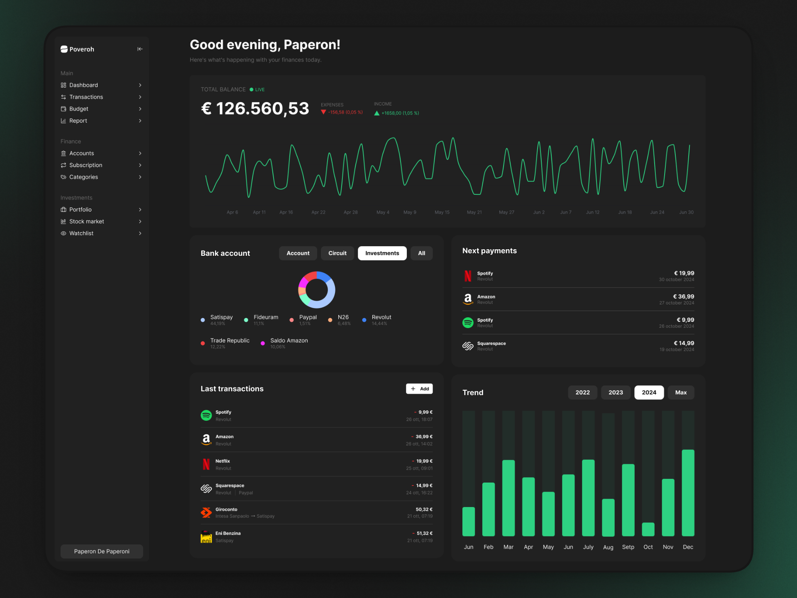

<div align="center">


# Poveroh

#### A Open-Source platform to track personal finance, built for clarity

<h4>
<a href="https://github.com/Poveroh/poveroh/issues/">Report Bug</a>
<span> · </span>
<a href="https://github.com/Poveroh/poveroh/issues/">Request Feature</a>
</h4>

<div>

[](https://www.gnu.org/licenses/gpl-3.0)


</div>

---

> “Money doesn’t buy happiness, but I’d rather cry in a Ferrari.”

</div>

<hr />

<!-- About the Project -->

## :star2: About Poveroh

<div align="center"> 
  
</div>

Poveroh is an open-source, web-based platform for tracking personal finances.

### Why?

This platform was born from the desire to track personal finances in a detailed and structured way.

Ok, there are thousands of similar applications out there, but none of them truly fit certain needs. Many lack a clean and intuitive UI/UX, and the few that do are often expensive—locked behind subscriptions or premium plans. That’s why this project was started - it aims to provide a scalable, open-source alternative that is easy to use, fast, and flexible—built with simplicity and clarity in mind.

This platform is essentially a web-based version of a Google Spreadsheet finance tracker, enhanced with features to make everything more user-friendly (the mobile app is planned and is included in the roadmap :) ).

### How it works?

The platform aggregates multiple bank accounts.

Users can manually input transactions or upload them via CSV or PDF.

Since it’s designed to track personal wealth, a snapshot of the month (including investments) will be taken on the last day of each month. This allows users to keep a historical record, generate reports, and monitor the growth of their assets over time.

In addition to individual transactions and bank account aggregation, the goal is to provide a platform for tracking investments as well, allowing to add financial products such as ETFs, stocks, bonds, crypto, and more.

> **Note**: Since this platform was designed based on personal needs, it may not be fully complete or include all the features that other users might consider essential.
>
> If you notice something missing from the roadmap or have an idea you’d like to see implemented, feel free to open an issue and share your suggestion!

<!-- TechStack -->

## :space_invader: Tech Stack

- <a href="https://www.typescriptlang.org/">Typescript</a>
- <a href="https://nextjs.org/">Next.js</a>
- <a href="https://tailwindcss.com/">TailwindCSS</a>
- <a href="https://better-auth.com/">Better-auth</a>

- <a href="https://nodejs.org/en">Node.js</a>
- <a href="https://expressjs.com/">Express.js</a>
- <a href="https://www.prisma.io/">Prisma</a>

- <a href="https://www.postgresql.org/">PostgreSQL</a>

## 🧱 Backend Architecture

Poveroh uses a modular monolith backend: the API remains simple to self-host and operate, while the code is organized around finance domains instead of broad technical layers.

Backend modules live under `apps/api/src/api/v1/modules/`. A module owns its HTTP controller, service workflow, repository queries, Zod schema exports, response mapper, and local types. Existing route paths stay REST-compatible, but new backend work should grow inside modules such as `financial-accounts`, `categories`, `subscriptions`, `transactions`, `imports`, `snapshots`, `dashboard`, and `reports`.

The layer boundaries are intentionally explicit:

- Controllers handle HTTP concerns only: parsing request data, validating with Zod schemas, extracting the authenticated user, calling services, and returning `ResponseHelper` envelopes.
- Services contain business workflows, ownership decisions, file handling orchestration, calculations, and lightweight domain event emission.
- Repositories are the only layer that talks to Prisma. They centralize `select`/`include` shapes, filtering, pagination, ownership scoping, soft-delete filters, and transactions.
- Mappers convert database records into API DTOs so raw Prisma entities are not exposed directly.

Prisma access is isolated behind repositories. Repository methods must scope financial data by `userId` and automatically exclude records with `deletedAt` unless a workflow explicitly needs historical records. Financial history is soft-deleted by default so transactions, subscriptions, accounts, assets, and snapshots remain auditable.

Reusable contracts and validation live in `packages/schemas` and are shared by OpenAPI generation, API validation, and frontend forms. API responses use the standard envelope:

```ts
{
    success: boolean
    message?: string
    data: T
    meta?: {
        pagination?: PaginationMeta
    }
}
```

The backend also includes lightweight internal domain events in `apps/api/src/api/v1/shared/events`. Events such as `transaction.created`, `financial-account.updated`, and `snapshot.generated` carry minimal IDs and user scope so side effects like cache invalidation, dashboard refreshes, analytics, or background jobs can evolve without coupling them directly to write services.

Dashboard and report features follow a CQRS-light approach: CRUD services handle write workflows, while dashboard/report modules should own read models and financial aggregations. Snapshots represent historical wealth state and should be treated as immutable financial records once generated.

## ⚙️ Background Jobs Architecture

Poveroh uses BullMQ for background jobs, with the implementation isolated behind `@poveroh/queue`. Application and domain code depend on a small `JobDispatcher` interface instead of importing BullMQ directly, so a future RabbitMQ adapter can replace the BullMQ adapter without changing services, controllers, or job payload contracts.

The queue package is organized around explicit contracts:

- `packages/queue/src/interfaces/` defines the provider-agnostic dispatcher API.
- `packages/queue/src/jobs/` defines the typed job registry and payloads.
- `packages/queue/src/adapters/bullmq/` contains all BullMQ-specific code.
- `apps/worker/` consumes jobs and calls application services to execute workflows.

Redis configuration is reused from the existing API Redis infrastructure in `apps/api/src/utils/redis.ts`. The API exposes the same Redis URL/password configuration used by the cache client, and the BullMQ adapter receives that configuration through the queue abstraction. New queue code should not read Redis env values independently or introduce a parallel Redis configuration system.

Domain events and background jobs are intentionally separate:

- `EventEmitter` is for lightweight local reactions such as cache invalidation, websocket updates, and synchronous side effects.
- BullMQ jobs are for heavier or delayed workflows such as imports, snapshot generation, market sync, notifications, cleanup, and scheduled processing.

Workers should orchestrate workflows and call services; they must not access Prisma directly or duplicate business logic. Scheduler code lives under `apps/worker/src/scheduler/` so cron-like behavior does not leak into domain services.

<!-- Color Reference -->

## :art: Color Reference

| Color            | Hex     |
| ---------------- | ------- |
| Primary Color    | #4E594A |
| Secondary Color  | #278664 |
| Background Color | #1C1C1C |
| Text Color       | #FFFFFF |

<!-- Getting Started -->

## :toolbox: Getting Started

To get a local copy up and running, please follow these simple steps.

<!-- Prerequisites -->

### :bangbang: Prerequisites

This project uses:

- [Node.js](https://nodejs.org/en/download/package-manager) (>= 22)
- [Docker](https://docs.docker.com/get-started/get-docker/) - to run PostgreSQL and NGIX CDN
- NPM

<!-- Run Locally -->

## :running: Run Locally

### Get start

1. Clone the project

    ```bash
    git clone https://github.com/Poveroh/poveroh.git
    ```

2. Go to the project folder

    ```bash
    cd poveroh
    ```

3. Install dependencies

    ```bash
    npm install
    ```

4. Copy `.env.example` file to `.env`, then edit it with the necessary values. For more details, read [docs](docs/ENV_SETUP.md).

    > If you don't modify them, the default values are sufficient to run the project.
    >
    > **Warning**: Since these are default values, security is not guaranteed.

    **Environment Files**: The project uses a dual environment system:
    - `.env` - For local development (DATABASE_HOST=localhost:5432)
    - `.env.production` - For Docker deployments (DATABASE_HOST=db:5432)

    Running `npm run setup` will automatically create both files from `.env.example`.

### Setup Database and CDN

> Docker and Docker Compose must be installed, up, and running on the machine.

1. Run `setup` file

    ```bash
    npm run setup
    ```

    Note: the setup flow may create a small local `proxy` service and to make local subdomains work you may need to add host entries (the repository includes `scripts/setup/proxy.js` which can add them for you).

    The command will execute the following steps:
    - Create and run database docker image.
    - Navigate to the `packages/prisma` directory.
    - Generate the Prisma client.
    - Apply any pending migrations to the database using Prisma.
    - Create and run CDN ngix docker image.

    <br>

    > **⚠️ Warning:**  
    > If you encounter any difficulties or something doesn't go as planned, read [this file](scripts/README.md) to execute it manually.

2. Create a user; open a browser to [localhost:3000/sign-up](http://localhost:3000/sign-up) and sign up.

3. _Optionally_, you can run the following exactly script to generate and fill database with fake data:

    ```bash
    npm run setup:data --user=<user_id_created_before>
    ```

    > You can find user ID on the [personal information page](http://localhost:3000/account/profile)

### Build and run

1. Build project

    ```bash
    npm run build
    ```

2. Run project

    ```bash
    npm run dev
    ```

## :rocket: Deployment

### Docker

1. First of all, create a folder

    ```bash
    mkdir poveroh-selfhost
    ```

2. Navigate to this folder using the cd command.

    ```bash
    cd poveroh-selfhost
    ```

3. Download setup file

    ```bash
    curl -fsSL -o setup.sh https://raw.githubusercontent.com/Poveroh/poveroh/refs/heads/main/scripts/docker/setup.sh
    ```

4. Make it executable

    ```bash
    chmod +x setup.sh
    ```

5. Then run it

    ```bash
    ./setup.sh
    ```

    > The script will create `.env` file. If you do not modify it, the default values are sufficient to run the project.
    >
    > If you want to build and run from scratch, download the repo (run only [Get start](#get-start) steps to download and setup), then run `npm run docker-dev`

### Railway

[](https://railway.com/deploy/UxenGr?referralCode=NfYCdO&utm_medium=integration&utm_source=template&utm_campaign=generic)

## :handshake: Contribuite

This repository follows the [GitHub](https://docs.github.com/en/get-started/using-github/github-flow) approach.

The development branch is `main`.

For more info, read the [docs](docs/CONTRIBUTING.md).

<!-- Roadmap -->

## :compass: Roadmap

In running order:

- [x] Login
- [x] Categories & subcategories
- [x] Bank accounts
- [x] Subscriptions
- [x] Transaction
    - [x] Manual insert
    - [x] Upload from CSV or PDF
- [ ] Month's snapshot
- [ ] Reports
- [ ] Investments
- [ ] Mobile app (iOS/Android) [probably in Flutter]

To give it an extra boost:

- [ ] Live investments
- [ ] What if: Based on monthly or annual spending, determine what you could have afforded if you hadn’t spent that money. This can help evaluate whether it’s necessary to reduce spending in non-essential categories to achieve certain goals.
- [ ] Memes
- [ ] Open banking

<!-- License -->

## :warning: License

Poveroh is released under the [GNU Affero General Public License v3.0 (AGPL-3.0)](https://github.com/Poveroh/poveroh/blob/main/LICENSE).

See LICENSE.txt for more information.

## :link: Useful links

- [Github Repo](https://github.com/Poveroh/poveroh)
- [Figma file](https://www.figma.com/design/SZz6f8cZ1mIE5s6Z4WGshu/Poveroh)
