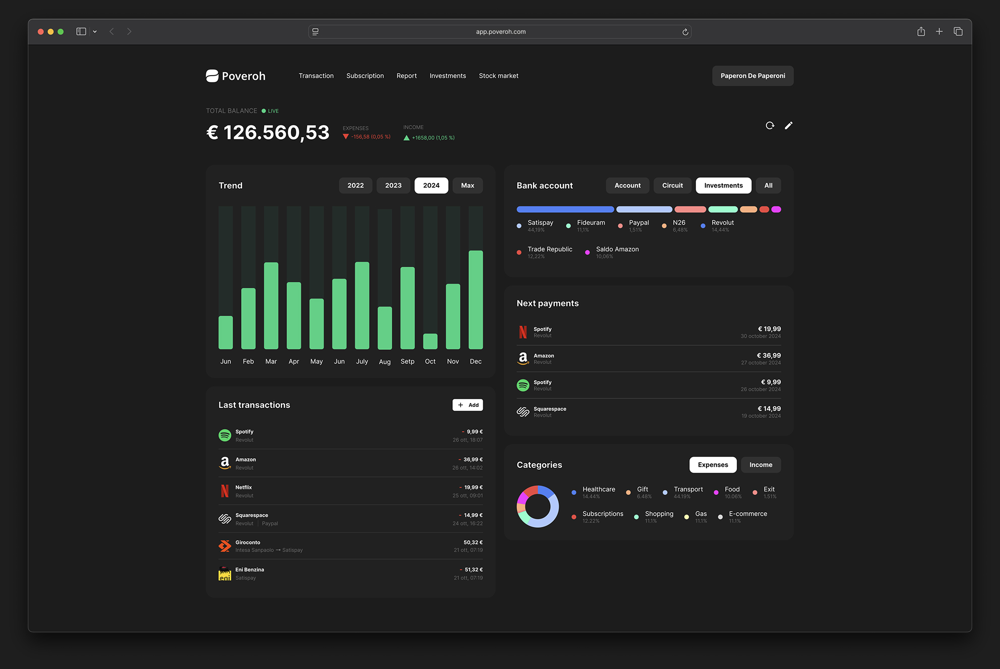

<div align="center">


# Poveroh

#### A unified platform to track your wealth.

<h4>
<a href="https://github.com/Poveroh/poveroh/issues/">Report Bug</a>
<span> · </span>
<a href="https://github.com/Poveroh/poveroh/issues/">Request Feature</a>
</h4>

<div>

[](https://opensource.org/licenses/MIT)

</div>

---

> “Money doesn’t buy happiness, but I’d rather cry in a Ferrari.”

</div>

<hr />

<!-- About the Project -->

## :star2: About the Project

<div align="center"> 
  
</div>

Poveroh is an open-source, web-based platform for tracking personal finances.

### Why?

This platform was born from the desire to track personal finances in a detailed and structured way.

Ok, there are thousands of similar applications out there, but none of them truly fit my needs or convince me entirely. That’s why, driven by the wish to learn new technologies, improve my skills, and create something of my own, I decided to develop this platform—without any big ambitions, just as a personal project.

Currently, I track my finances using a Google Spreadsheet. This platform is essentially the web version of that spreadsheet (with some cool features to make everything more user-friendly).

### How it works?

The platform aggregates multiple bank accounts.

Users can manually input transactions or upload them via CSV or PDF.

Since it’s designed to track personal wealth, a snapshot of the month (including investments) will be taken on the last day of each month. This allows users to keep a historical record, generate reports, and monitor the growth of their assets over time.

In addition to individual transactions and bank account aggregation, the goal is to provide a platform for tracking investments as well, allowing to add financial products such as ETFs, stocks, bonds, crypto, and more.

> **Note**: This platform is currently tailored to meet my personal needs. It may not be fully complete or include features and services that others might find essential.

<!-- TechStack -->

## :space_invader: Tech Stack

- <a href="https://www.typescriptlang.org/">Typescript</a>
- <a href="https://nextjs.org/">Next.js</a>
- <a href="https://tailwindcss.com/">TailwindCSS</a>

- <a href="https://nodejs.org/en">Node.js</a>
- <a href="https://expressjs.com/">Express.js</a>
- <a href="https://www.prisma.io/">Prisma</a>

- <a href="https://www.postgresql.org/">PostgreSQL</a>

<!-- Color Reference -->

## :art: Color Reference

| Color            | Hex                                                              |
| ---------------- | ---------------------------------------------------------------- |
| Primary Color    |  #4E594A |
| Secondary Color  |  #278664 |
| Background Color |  #1C1C1C |
| Text Color       |  #FFFFFF |

<!-- Getting Started -->

## :toolbox: Getting Started

To get a local copy up and running, please follow these simple steps.

<!-- Prerequisites -->

### :bangbang: Prerequisites

This project uses:

- [Node.js](https://nodejs.org/en/download/package-manager) (>= 18.x)
- [Docker](https://docs.docker.com/get-started/get-docker/) - to run PostgreSQL and NGIX CDN
- NPM

<!-- Run Locally -->

## :running: Run Locally

### Get start

1. Clone the project

    ```bash
    git clone https://github.com/Poveroh/poveroh.git
    ```

2. Go to the project folder

    ```bash
    cd poveroh
    ```

3. Install dependencies

    ```bash
    npm install
    ```

4. Copy `.env.example` file to `.env`, then edit it with the necessary values. For more details, read [docs](ENV_SETUP.md).

    > If you don't modify them, the default values are sufficient to run the project.
    >
    > **Warning**: Since these are default values, security is not guaranteed.

### Setup Database and CDN

> Docker and Docker Compose must be installed, up, and running on the machine.

1. Run `setup` file

    ```bash
    npm run setup
    ```

    The command will execute the following steps:

    - Create and run database docker image.
    - Navigate to the `packages/prisma` directory.
    - Generate the Prisma client.
    - Apply any pending migrations to the database using Prisma.
    - Create and run CDN ngix docker image.

    <br>

    > **⚠️ Warning:**  
    > If you encounter any difficulties or something doesn't go as planned, read [this file](./scripts/README.md) to execute it manually.

2. Create a user; open a browser to [http://localhost:5555](http://localhost:5555) and fill out Users table with fields:

    - `name`
    - `surname`
    - `email`
    - `password`, the password must first be encrypted using [SHA-256](https://codebeautify.org/sha256-hash-generator), and then the resulting hash should be encrypted using [BCrypt](https://bcrypt-generator.com/) with 12 rounds (store this in password field).

3. _Optionally_, you can run the following exactly script to generate and fill database with fake data:

    ```bash
    npm run setup:data --user=<user_id_created_before>
    ```

### Build and run

1. Build project

    ```bash
    npm run build
    ```

2. Run project

    ```bash
    npm run dev
    ```

## :rocket: Deployment

### Docker

1. First of all, run only [Get start](#get-start) steps to download and setup.

2. Then, run:

    ```bash
    npm run docker
    ```

    > This command will download Poveroh's packages from cloud and will run them.

    > If you want to build and run from scratch, run `npm run docker-dev`

## :handshake: Contribuite

This repository follows the [GitHub](https://docs.github.com/en/get-started/using-github/github-flow) approach.

The development branch is `main`.

For more info, read the [docs](CONTRIBUTING.md).

<!-- Roadmap -->

## :compass: Roadmap

In running order:

- [x] Login
- [x] Categories & subcategories
- [x] Bank accounts
- [ ] Transaction
    - [ ] Manual insert
    - [ ] Upload from CSV or PDF
- [ ] Month's snapshot
- [ ] Subscriptions
- [ ] Reports
- [ ] Investments
- [ ] Mobile app (iOS/Android) [probably in Flutter]

To give it an extra boost:

- [ ] Live investments
- [ ] What if: Based on monthly or annual spending, determine what you could have afforded if you hadn’t spent that money. This can help evaluate whether it’s necessary to reduce spending in non-essential categories to achieve certain goals.
- [ ] Memes
- [ ] Open banking

<!-- License -->

## :warning: License

Poveroh is released under MIT license. You are free to use, modify and distribute this software, as long as the copyright header is left intact.

See LICENSE.txt for more information.

## :link: Useful links

- [Github Repo](https://github.com/Poveroh/poveroh)
- [Figma file](https://www.figma.com/design/SZz6f8cZ1mIE5s6Z4WGshu/Poveroh?node-id=232-100&t=1ozuf8X78WOqBXYH-1)
